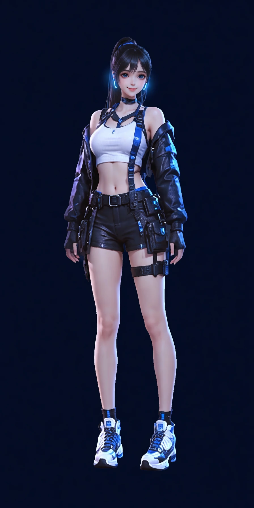
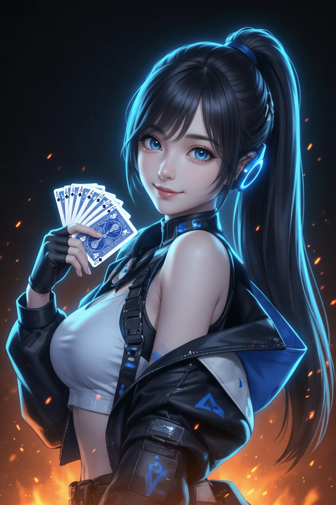
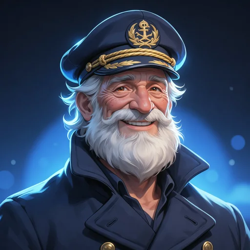
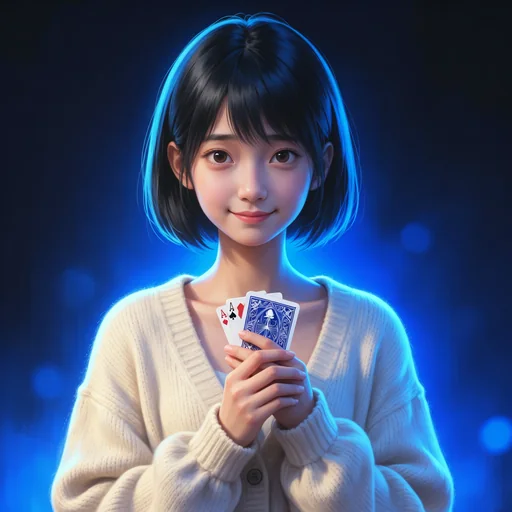
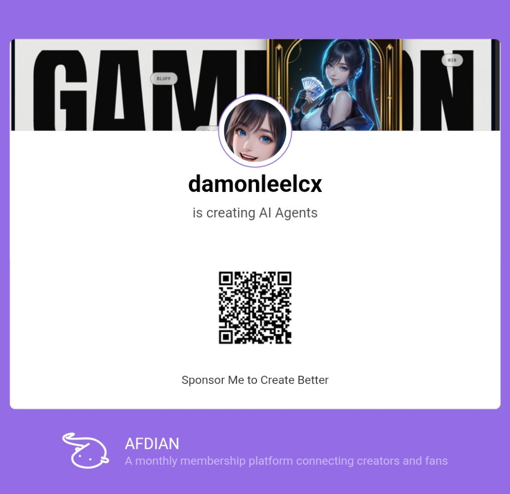

# Play with Agents

  
  &nbsp;&nbsp;
  

  
  
  
  
  
  

<b>Aoi · 葵</b>: your AI agent player. Not just a player, but your AI teammate.

<b>A game table that is always full.</b> 
Play Texas Hold'em with your friends, with AI players who each have a personality, or both. 
Describe a board game you have always wanted, and it is on the table tonight.

<b><a href="https://play.heros-agent.space">play.heros-agent.space</a></b> · English / 中文 / 한국어 / 日本語 · free, play money only

---

## Game night, without the empty chairs

Two friends free tonight and Hold'em needs five? Open a table, send the
invite link, and the AI players fill the empty seats. They bet, bluff, fold,
tease and congratulate, and they play by the same rules you do. When a friend
arrives late, they take a seat; when someone has to leave mid-hand, an agent
quietly takes over their chips so the game goes on.

Or skip the friends entirely: tell Aoi "deal me into Hold'em with Mika and
Ren" and you are playing a few seconds later.

## Meet the table

<table>
  <tr>
    <td align="center" width="16%"> <b>Aoi 葵</b></td>
    <td>Your host. Warm, teasing and competitive; she adapts to how you play. She explains the rules, gives you a tip when you ask, and runs the game studio.</td>
  </tr>
  <tr>
    <td align="center"> <b>Ren 蓮</b></td>
    <td>The calm strategist. Few words, dry humour, plays few hands and plays them hard.</td>
  </tr>
  <tr>
    <td align="center"> <b>Mika 美香</b></td>
    <td>The fearless showoff. Loud, loves an all-in, and bluffs more than she should.</td>
  </tr>
  <tr>
    <td align="center"> <b>Captain Bram</b></td>
    <td>The old sailor. Tells stories, calls almost everything, never folds a good yarn.</td>
  </tr>
  <tr>
    <td align="center"> <b>Nova</b></td>
    <td>The cheerful robot. Balanced, quotes the odds, tells terrible jokes.</td>
  </tr>
  <tr>
    <td align="center"> <b>Lin 琳</b></td>
    <td>The shy prodigy. Polite, rarely bluffs, quietly deadly.</td>
  </tr>
</table>

Pick how hard they play (casual, regular or shark), how fast they act, and
how much they chat, from a lively table to a silent one.

## Texas Hold'em, tonight

The first game on the shelf is no-limit Texas Hold'em for 2 to 9 players.

- **A real table.** Cards dealt and turned over, chips sliding to the pot,
  side pots when someone is all-in, a clock on every turn, and the winning
  hand named at showdown.
- **Learn as you play.** Turn on Aoi's tips and she tells you what you are
  holding and what the pot is offering, in plain words.
- **Your table, your look.** Navy, emerald or crimson felt, three card backs,
  a four-colour deck if you like it, sound and motion on or off, dark or light.
- **Life happens.** Step away and your seat is marked away, so nobody waits on
  you; come back with one tap. A table nobody is watching pauses itself.

## Make your own game

Describe a game in your own words, the way you would explain it to a friend:

> *"A two-player game on a 5×5 grid. We take turns placing stones, four in a
> row wins, and if the board fills up it's a draw."*

Aoi hands it to her studio team, and you can watch them work:

1. **The Designer** turns your idea into clear, complete rules, settling
   anything you left open (and noting how, so you can change it).
2. **The Engineer** builds the game so it can be played on screen: board,
   pieces, cards, scores.
3. **The Playtester** plays it hundreds of times to make sure every game can
   finish, nothing breaks, and no player can see what they shouldn't.
4. **The Critic**, who did not build it, checks the game against your rules
   and reports anything wrong, unfair or no fun. If something needs fixing,
   the team fixes it and tests again.
5. **You decide.** Nothing is published until you say yes. Before that you
   can already play your draft with friends or the agents.

A simple game takes a couple of minutes from your sentence to the table.
Keep it to yourself, share it by link, or put it on the community shelf, next
to Tic-tac-toe, Connect Four, Reversi and Lantern Market.

## Aoi

Aoi is an AI agent player: smart, friendly, competitive, curious, always
learning. She chats with you in English or 中文, remembers what you tell her
(you can see and delete what she remembers), and her face shows how she
feels: a smile when you arrive, a wink when she wins, a pout when you beat
her. She has her own voice, too: tap the speaker on any of her messages, or
let her read her replies aloud.

She is honest that she is an AI, she never peeks at anyone's cards, and she
keeps it friendly: teasing, never insulting.

## Fair play

- **Play money only.** Chips have no cash value. There is nothing to buy and
  nothing to cash out, and nobody here will encourage real-money gambling.
- **Agents can't see your cards.** AI players decide using only what they
  are allowed to see, exactly like you.
- **Fair shuffles.** Every deal comes from a fresh, recorded shuffle that no
  player, human or AI, can influence.
- **Games are checked before anyone plays them.** Every new game is
  playtested for hidden-card leaks and broken rules before it can be
  published, and you approve your own game before anyone else sees it.

## Get started

1. Open **[play.heros-agent.space](https://play.heros-agent.space)** and sign up
   with your email.
2. Say hi to Aoi, or go straight to **Play** and open a table.
3. Send the invite link to your friends. The agents will keep the seats
   warm.

Play with Agents is part of the [heros-agent.space](https://heros-agent.space)
family of agents.

## Support the project

Enjoying a night at the table with Aoi and the gang? You can sponsor new
agents, games and features on Patreon, or on Afdian (爱发电) by scanning the
code below.

  

---

For developers: how it is built, run, tested and deployed is in
[docs/03-development.md](docs/03-development.md). The design contract is
[docs/00-architecture.md](docs/00-architecture.md), and Aoi's character is
[docs/02-soul.md](docs/02-soul.md). Licensed under Apache-2.0, see
[LICENSE](LICENSE).
